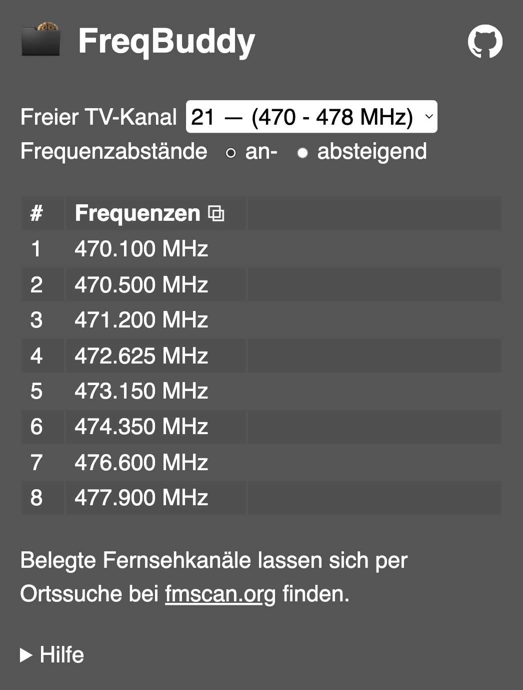

# FreqBuddy

*FreqBuddy* zeigt Dir die besten 8 untereinander störungsfreien Funkfrequenzen innerhalb eines TV-Kanals (8-MHz-Raster) an.

## Inhaltsverzeichnis

* [Hinweis](#hinweis)
* [Regeln und Randbedingungen](#regeln-und-randbedingungen)
* [Weitere Funktionen](#weitere-funktionen)
* [Installation](#installation)

## Hinweis

*FreqBuddy* ist für den Einsatz in Deutschland ausgelegt. Auch wenn die TV-Kanäle nicht nur in Deutschland ihren Einsatz finden, so sind die Ausschlüsse (Radioastronomie und LTE) auf deutsche Gegebenheiten angepasst. Auch weitere Anmerkungen sind ausschließlich auf deutsche Regeln angewandt.

__Achtung: *FreqBuddy* ist ein mathematisches Tool zur Berechnung von optimalen Frequenzen. Ob der Einsatz dieser Frequenzen für Deine Anwendung erlaubt ist musst Du selbst prüfen.__

## Regeln und Randbedingungen

- Dieses Tool betrachtet immer nur einen TV-Kanal für sich allein.
- Zusätzliche Frequenzen dieses Tools aus anderen TV-Kanälen sind **nicht** auf Kompatibilität untereinander geprüft.
  - Nahe liegende TV-Kanäle werden **nicht** störungsfrei funktionieren.
  - Weit entfernte TV-Kanäle können störungsfrei funktionieren.
- Die Frequenzabstände innerhalb eines TV-Kanals sind spiegelbar. Standardmäßig wird der Abstand zu jeder höheren Frequenz größer (ansteigend). Dies kann mit der Wahl 'absteigend' umgedreht werden.
 - Dies ist z.B. für ein zweites, gleichzeitig zu nutzendes Set an Frequenzen zu empfehlen. Das zweite Set sollte so weit wie möglich vom ersten entfernt sein und statt der an- die absteigenden
 Frequenzabstände nutzen.
- Sollen Sender und Empfänger in einer Kameratasche nebeneinander betrieben werden, muss
  - der physische Abstand zwischen den Antennen des Senders und des Empfängers so groß wie möglich gewählt werden.
  - Sender und Empfänger mindestens 8 MHz, besser 16 oder 24 MHz Abstand voneinander haben, um das Sender-Empfänger-Blocking möglichst gering zu halten.
- Es stehen höchstens 8 Frequenzen in einem TV-Kanal zur Verfügung.
- TV-Kanäle nahe LTE haben auf Grund der Schutzlücke weniger Frequenzen zur Verfügung.
  - Mit absteigenden Frequenzabständen sinkt die Anzahl der nutzbaren Frequenzen für diese TV-Kanäle nochmals.
- Die Intermodulationsfreiheit ist berechnet mit:
  - min. 400 kHz Trägerabstand
  - min. 200 kHz Abstand 2TX-IM(3) - Intermodulation 3. Ordnung von 2 Sendern
  - min. 100 kHz Abstand 3TX-IM(3) - Intermodulation 3. Ordnung von 3 Sendern
- Die Intermodulationsfestigkeit ist berechnet mit:
  - F1: 54 %
  - F2: 65 %
  - F3: 49 %
  - F4: 67 %
  - F5: 81 %
  - F6: 63 %
  - F7: 82 %
  - F8: 66 %
  - Je höher die Prozentzahl, desto besser ist das Signal.
  - Die Mindestanforderungen zur Intermodulationsfestigkeit sind in jedem Fall erfüllt.
  - Diese Werte gelten für die ansteigenden Frequenzabstände. Für die absteigenden Frequenzabstände ist die Reihenfolge umzudrehen.
- Handgeräte mit Frequenzen zwischen 823 - 826 MHz dürfen nur mit reduzierter Sendeleistung von maximal 82 mW betrieben werden.

## Weitere Funktionen

Folgende weitere Funktionen sind im Tool enthalten:
- Mit dem Link zu [fmscan.org](https://fmscan.org/locsearch.php?reset=1&r=t&m=s) kann man die bereits mit DVB-T belegten TV-Kanäle manuell ausschließen.
- Mit Klick auf eine einzelne Frequenz, wird diese im Vollbild angezeigt.
- Mit Klick auf das Kopiersymbol (⧉) rechts neben der Tabellenüberschrift 'Frequenzen' wird die komplette Tabelle in den Zwischenspeicher kopiert.
- Der zuletzt ausgewählte TV-Kanal wird für 7 Tage in einem Cookie gespeichert und beim nächsten Laden der Webseite wieder ausgewählt.
- Ebenso werden die an- oder absteigend ausgewählten Frequenzabstände in einem Cookie gespeichert.

## Installation

Zur Installation, Adaption und eigenen Nutzung kann einfach dieses Repo auf einem Webserver geklont werden. In der `index.php` sind die 2 Zeilen PHP-Code zu entfernen, die darunter liegenden HTML-Code-Zeilen wieder zu aktivieren und anzupassen. Die `index.php` kann dann auch in eine `index.html` umbenannt werden.
